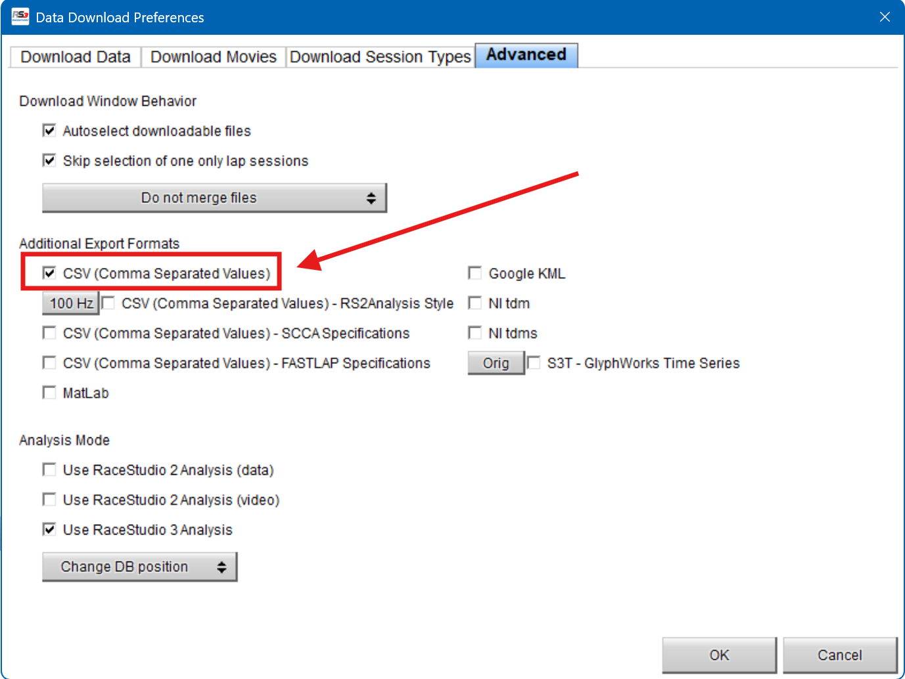

# MyChron-GPS-to-Insta360


**Vibe coded!**

Convert **RaceStudio3 GPS CSV exports** (from **MyChron** GoKart lap timers) into **GPX** and **FIT**
files that the **Insta360 app / Insta360 Studio "Stats Dashboard"** can overlay onto your action-cam
video: speed, altitude, distance, gradient and a track map, all synced automatically to the footage.

A single Windows `.exe`, with no runtime to install. **Drag the export folder onto it**, or
**double-click** to pick it, or drive it from the **command line**.

## Download

⬇️ **[Latest release: `MyChron2Insta360.exe`](https://github.com/bolausson/MyChron-GPS-to-Insta360/releases/latest/download/MyChron2Insta360.exe)**.
It is a single self-contained Windows 11 binary (no .NET install needed). That link always points at the
newest build. You can also browse [all releases](https://github.com/bolausson/MyChron-GPS-to-Insta360/releases).

## Getting the CSV export from RaceStudio3

The single "AiM CSV" export resamples everything to one rate and has no true GPS time. Instead, use the
per-channel CSV export, which gives GPS at its native rate plus a GPS-time column. Enable it once:

> **Preferences, Data Download Preferences, Advanced Tab, Additional Export Formats,**
> tick **"CSV (Comma Separated Values)"**



Now exporting a session writes a **`..._CSV`** folder containing one file per channel. This tool reads
the GPS files from it:

- **`_GPS_o.csv`**: raw receiver rate (**25 Hz** on MyChron 6). *Default.*
- **`_GPS.csv`**: a 10 Hz decimation.

Columns: `time, itow, lat, lon, alt, speed, accuracy`, where **`itow`** is GPS time-of-week.

## Why this is accurate

Insta360 syncs telemetry to video **by absolute timestamp**. The `itow` column is real GPS time, so the
tool derives **exact UTC to the millisecond**. There is no timezone to configure and no guessing (the
calendar date is read from the RaceStudio folder path). A `--nudge` / *Time nudge* control remains for
trimming any residual camera-clock offset.

## Multiple sessions

The MyChron starts a **new session** whenever the kart slows or stops, so one continuous video can span
several sessions (several `_CSV` folders). Point the tool at a **parent folder** and it finds them all.
Because every point has exact GPS time, they line up on one timeline automatically.

- **Default:** each session becomes its own output file.
- **Merge** (CLI `--merge` / GUI "Merge sessions into one file"): all sessions combined into a single
  output, with one GPX track segment per session so no line is drawn across the stopped gaps.

Output names: an individual file takes its session folder's name. A merged file is
**`merged-YYYYMMDD-HHMMSS`** built from the earliest GPS timestamp (UTC). Override with `--out`, or
place the files elsewhere with `--out-dir`.

## Features

- Reads a RaceStudio `_CSV` folder, a **parent folder of several**, or a `_GPS*.csv` directly.
- **Exact UTC from GPS `itow`**, so no timezone configuration.
- Keeps the **native GPS rate** (25 Hz), with optional downsample.
- Optional **merge** of multiple sessions, accuracy filter, standstill trim, and **output folder**.
- Writes **GPX 1.1** (`gpxtpx` speed) and/or **FIT** (official Garmin SDK).
- **CLI + GUI** in one binary.

## Build

Requires the **.NET 10 SDK** (`winget install Microsoft.DotNet.SDK.10`).

```powershell
# Build a single self-contained .exe (no .NET needed on the target machine)
dotnet publish src/MyChron2Insta360.App -c Release
# output: src/MyChron2Insta360.App/bin/Release/net10.0-windows/win-x64/publish/MyChron2Insta360.exe
```

## Usage

**GUI:** double-click `MyChron2Insta360.exe`, then drag the `..._CSV` folder onto it (or use *Folder…*).

**CLI:**

```powershell
MyChron2Insta360 "...\Session_..._CSV"                       # one session, GPX, native 25 Hz
MyChron2Insta360 "...\Casteluccio" --format both             # parent folder, one file per session
MyChron2Insta360 "...\Casteluccio" --merge --out-dir C:\out  # merge all sessions into one file
MyChron2Insta360 "...\_GPS_o.csv" --hz 10 --nudge -1.5
MyChron2Insta360 --help
```

| Option | Meaning |
|---|---|
| `--merge` | Merge all sessions into ONE output (default: one file per session) |
| `-o, --out <file>` | Explicit output path, single output only (extension set per format) |
| `--out-dir <folder>` | Write outputs into this folder (created if needed) |
| `--format <gpx\|fit\|both>` | Output format(s). Default `gpx` (`--fit` / `--both` are shortcuts) |
| `--gps10` | Use `_GPS.csv` (10 Hz) instead of `_GPS_o.csv` (25 Hz) |
| `--hz <n>` | Downsample to n Hz (default: native rate) |
| `--nudge <seconds>` | Shift every timestamp to fine-tune sync |
| `--max-accuracy <m>` | Drop fixes with reported accuracy worse than m metres (default: keep all) |
| `--date <YYYY-MM-DD>` | Override the session date (only if it isn't in the folder path) |
| `--leap <n>` | GPS-UTC leap seconds for iTOW (default 18) |
| `--trim` | Trim leading/trailing standstill per session (off by default) |

Then in the Insta360 app: **Dashboard, Data Source, Local Files, Import**.

## Project layout

```
src/
  MyChron2Insta360.Core/   RaceStudioGpsCsv (parser), ItowTime (GPS to UTC), Conversion (build/downsample),
                           GpxWriter, FitWriter
  MyChron2Insta360.App/    single .exe: CLI (Cli.cs) + WinForms GUI (MainForm.cs)
```

Note: the original XRK file is a proprietary AiM binary. This tool intentionally uses the documented
CSV export instead of a native XRK reader, to stay a dependency-free single binary.

## License

[GNU General Public License v3.0](LICENSE). Copyright (C) 2026 Bjoern Olausson.
